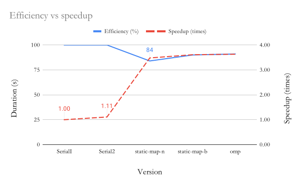

= Comparisons report
:experimental:
:nofooter:
:source-highlighter: highlightjs
:sectnums:
:stem: latexmath
:toc:
:xrefstyle: short

== Imperative vs Declarative concurrency (pthreads vs omp)

The declarative concurrency implementation with the Open MP (omp) API, which followed the same structure as the final concurrent version with static map by blocks, proved to be slightly faster than its predecessor. For instance, as is notable in <<duration_vs_speedup>>, the time reduced from the final version's 2044.783 seconds to 2031.477 seconds, while the speedup had a small increase of 0.02 (3.63 times faster than the initial serial version).

[[duration_vs_speedup]]
.Updated durations vs speedup graph
image::images/duration_vs_speedup.svg[align=center]

Moreover, the declarative concurrency version proved to be 1% more efficient than the imperative concurrency version, though it's not notable in <<efficiency_vs_speedup>>.

[[efficiency_vs_speedup]]
.Updated efficiency vs speedup graph

Another notable point is that the declarative concurrency version produced better runtimes than imperative concurrency's iterations. The following table shows a comparison between the durations yielded from three iterations of the final concurrent version and the omp version, both executed in the release version with the same amount of threads as cores available in the Poas cluster.

[%autowidth]
|===
s| Imperative concurrency s| Declarative concurrency
| 2044.78302451s | 2031.476653996s
| 2270.302407554s | 2062.683600158s
| 2257.216094095s | 2044.78302451s
|===

All in all, the resulting data suggests that omp could be a better alternative to plain pthread implementation, not to mention the syntactic sugar the former provide, though control is surrendered to the convenient tool.