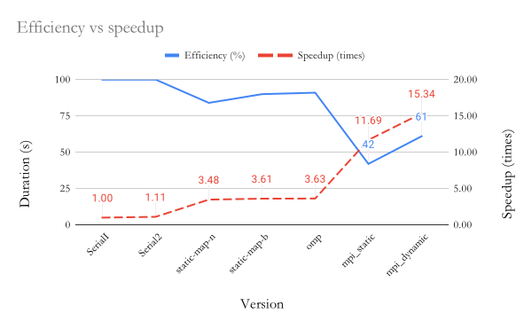

= Comparisons report
:experimental:
:nofooter:
:source-highlighter: highlightjs
:sectnums:
:stem: latexmath
:toc:
:xrefstyle: short

This report compares imperative and declarative concurrency: the runtimes obtained, speedups, and efficiencies. It also analyzes the performance of distributing the program across processes and the implications behind it, static distribution, as well dynamic distribution.

== Imperative vs Declarative concurrency (pthreads vs omp)

The declarative concurrency implementation with the Open MP (omp) API, which followed the same structure as the final concurrent version with static map by blocks, proved to be slightly faster than its predecessor. For instance, as is notable in <<duration_vs_speedup_omp>>, the time reduced from the final version's 2044.783 seconds to 2031.477 seconds, while the speedup had a small increase of 0.02 (3.63 times faster than the initial serial version).

[[duration_vs_speedup_omp]]
.Updated durations vs speedup graph

Moreover, the declarative concurrency version proved to be 1% more efficient than the imperative concurrency version, though it's not notable in <<efficiency_vs_speedup_omp>>.

[[efficiency_vs_speedup_omp]]
.Updated efficiency vs speedup graph

Another notable point is that the declarative concurrency version produced better runtimes than imperative concurrency's iterations. The following table shows a comparison between the durations yielded from three iterations of the final concurrent version and the omp version, both executed in the release version with the same amount of threads as cores available in the Poas cluster.

[%autowidth]
|===
s| Imperative concurrency s| Declarative concurrency
| 2044.78302451s | 2031.476653996s
| 2270.302407554s | 2062.683600158s
| 2257.216094095s | 2044.78302451s
|===

All in all, the resulting data suggests that omp could be a better alternative to plain pthread implementation, not to mention the syntactic sugar the former provides, though control is surrendered to the convenient tool.

== Serial vs Concurrent vs Distributed
=== Implemented MPI versions
Two types of distribution were implemented: static and dynamic. The first one distributed work between the involved processes with the static map by blocks formula. After finishing the simulation of the assigned region in the plates array, the first process would report the information for the plates it was assigned, and then receive the states simulated for the remaining plates from the corresponding process. This version can be found in the **omp_mpi/** folder in the *DistributedStatic* branch of the repository.

On the other hand, the dynamic version divided processes into two roles: the first process was the designated master, the distributor of work, and the rest were workers tasked with processing plates. For more information about this implementation, check out the document in the **design/** folder.

=== Data analysis and graphs interpretations

Following the previous versions' data compilation, three executions with job020 were performed in the Poas cluster in release mode, but this time requesting 7 nodes to run 1 process each (with the same amount of threads as cores were available in each device), for the two distributed versions. The overall program runtime taken into account corresponded to the biggest duration reported by the last processes to conclude. Moreover, the efficiencies of the distributed versions were calculated with the amounts of involved threads only: 28 for static (7 processes using 4 threads each), and 25 for dynamic (1 process only used 1 thread as master, and the other 6 used 4 for processing plates).

The graph in <<duration_vs_speedup_mpi>> shows the updated duration vs speedup comparison across versions of the simulation. A notable improvement in runtime from the last concurrent version can be identified: an approximate 1300 seconds (a bit over 20 minutes) decrease from omp to mpi_static, and an approximate 1500 second difference (almost 25 minutes) between the last concurrent version and the dynamic distribution version.

[[duration_vs_speedup_mpi]]
.Durations vs speedup graph with distributed versions' data

Through the illustration of the significant decrease in execution time and dramatic increase in speedup from the initial serial version to the dynamic distributed version, the graph suggests that each variation of the serial, concurrent, and distributed version is bound to hover around the same runtime as its similars. For instance, all of the concurrent versions had durations of around 2000 seconds, or 30 minutes, while the distributed versions generally lasted less than half of that time, both clearly much faster than the average 7000-8000 seconds (2 hours) serial versions lasted. This hints at a possible temporal asymptote that each paradigm may have, implying the necessity of concurrency or distribution for optimized performances. The implementation of one or the other for better durations however, should still take efficiency into consideration, as is compared in the following graph.

[[efficiency_vs_speedup_mpi]]
.Efficiency vs speedup graph with distributed versions' data

<<efficiency_vs_speedup_mpi>> shows an irregular trend for efficiency in comparison with previous versions of the graph. A significant decrease in this effect is visible, from concurrent versions to distributed versions: where concurrent versions had 80-90% efficiency, distributed versions only had 61% at best, and 42% at worst. This meant that the speedup-to-resources-usage tradeoff does not seem as worth it for distributed versions, in comparison with concurrent ones.

=== Static vs dynamic distribution

Although the two versions demonstrated to have similar overall plate simulation times, the dynamic version was faster in the total program runtime, possibly due to the order in which the reporting process completed the full simulation: it did not have to wait during the reporting portion for processes to send their results, potentially stalling.

However, a downside of the dynamic version is that one process is bound to the master role, meaning it does not make use of the other available threads to process plates, while its static counterpart makes use of all available processes to simulate plates. Nonetheless, the speedup and efficiency obtained from both versions suggests that a dynamic distribution approach is more advantageous than a static one, yielding greater speedup with better efficiency.

=== Final observations

All in all, distribution and concurrency both showed to have pros and cons when it came to optimizing the poor performance of serial versions. With sufficient resources at hand (a formidable cluster, for one), distribution, preferrably dynamic, would be the best option for optimizing the duration a program, leading to a great speedup. On the contrary, if resources are limitted and the time optimization needed is not demanding, then concurrency (declarative, for simplicity) would be the smarter choice. 

== Data spreadsheet
The following spreadsheet contains all of the data used for analyzing and comparing performances between versions of the heat transfer simulation.

Link: https://docs.google.com/spreadsheets/d/1FOsv30rT03TahYkjyai7WPhJPS8wt92tpIzp7Kk8dsc/edit?usp=sharing[heat_simul_data_evan_chen]

NOTE: To access the information for omp and mpi, refer to the *omp* and *distributed* sheets. Evidences of program executions for the omp_mpi version are attached in the subfolders inside comparisons/. The rest can be found in the reports/ folder in optimized (version 1.3 of the simulation)
