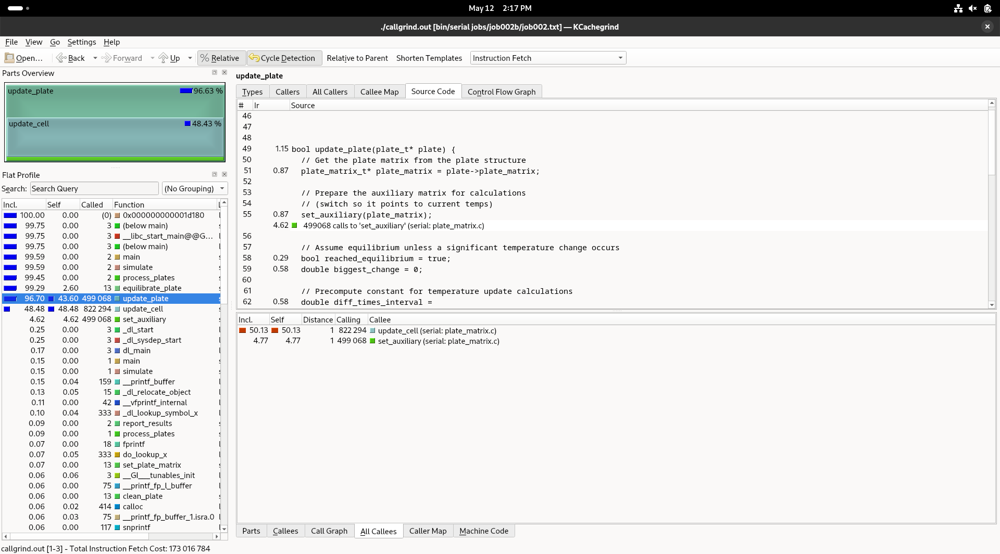

= Optimizations Report
:experimental:
:nofooter:
:source-highlighter: highlightjs
:sectnums:
:stem: latexmath
:toc:
:xrefstyle: short

== Versions History
Several versions of the heat transfer simulation have been created, seeking to optimize and reduce the processing time of jobs. The following table summarizes all existing versions of the heat transfer simulation. Note that different branches were used to preserve previous official versions and allow widespread testing.

[%autowidth]
|=== 
s|# s|Id s|Branch s|Folder s|Description
| 1 | Serial0 (hw01) m| main m| serial/ | Initial serial version
| 2 | Serial1 m| SerialOptimizations m| serial/ | Added flattened matrix and avoided unnecessary calculations
| 3 | Conc1 (hw02) m| main m|pthread/ | Attempt of static map without formula and no thread reutilization
| 4 | Conc2 m| ConcurrentStaticNoBarrier m|pthread/ | Added static map formula usage and flattened matrix to Conc1
| 5 | Conc3 m| ConcurrentStatic m|pthread/ | Added barriers and thread reutilization (static map by blocks)
| 6 | Conc4 m| ConcurrentDynamic m|pthread/ | Modify Conc1 to implement dynamic map with producer-consumer pattern
|===

To switch from branches, use the `git checkout [branchname]` command in terminal.

== Serial Optimizations
=== Profiling
The initial serial version had potential optimization points, like reducing access times by flattening the matrix into an array, and avoiding unnecessary calculations during every equilibrating iteration. This is further backed up by the profiling process made with KCachegrind, where there is considerable CPU occupation with the update_plate and update_cell procedures. 

[[img_profiling]]
.Screenshot of profiling with Kcachegrind in initial serial version (hw01)

For instance, the update_plate procedure calculated the multiplication constant every equilibrating iteration, when it could be done once only, before invoking the procedure.

The following figure shows the results of executing the original serial version of the program with the `job020` file, one of the more time-consuming jobs given the large plates it involves. It's note-worthy to mention that all serial versions were executed in the 106 laboratory of the University of Costa Rica.

[[img_serial0]]
.Screenshot of terminal after executing serial0 version (original)
image::images/serial_executions/serial0.png[]

The job was completed in *8200.470676406 seconds*, or roughly *2 hours and 17 minutes*, meaning there was lot's of wiggle (improvement) space for the following optimizations.

=== Serial1: Flattening the matrix
This first optimization consisted in implementing the plate as an array instead of a matrix. Advantages of this modification include reduction of cache misses (given that secondary pointers to rows are removed) and faster looping through the plate. However, there is a risk that using an array instead of a matrix could present problems for plates of greater sizes, given that it makes the program dependent on the capacity of the machine running it (the array implies continuous memory).

The following figure shows the results of executing this version with `job020`.

[[img_serial1]]
.Screenshot of terminal after executing serial1 version (flattened matrix)
image::images/serial_executions/serial1.png[]

Compared to its predecessor, this version proved to equilibrate each plate considerably faster, with a final execution time of *7396.980168424 seconds*, or approximately *2 hours and 4 minutes*. This shows a 13 minute improvement. However, another potential optimization was discovered after implementing the flattened matrix: reducing unnecessary calculations, which will be discussed in the next section.

=== Serial2: Reduce calculations
A second part of the serial optimization consisted in avoiding the multiplication constant calculation multiple times and instead, calculate it once before the while loop to equilibrate the plate, passing it as a parameter. These changes were made to the plate and job classes, moving the calculation from `update_plate()` to `equilibrate_plate()`, which calls the former.

The following figure presents the results of testing this version with the same job that serial0 and serial1 were tested with.

[[img_serial2]]
.Screenshot of terminal after executing serial2 version (reduce unnecessary calculations)
image::images/serial_executions/serial2.png[]

The results were not as positive as expected, with little to no improvement (*7379.810091 seconds* of equilibration time, translated to *2 hours and 3 minutes*). Evidently, avoiding the re-calculation of the multiplication constant did not really improve the runtime of the program by a lot.

=== Comparison table
The following table summarizes the total duration and speedup of each serial optimization.

[%autowidth]
|===
s| Itr s| Tag s| Duration s| Speedup s| Brief Description
|- | Serial0 | 8200.47 | 1.00 | Initial version (hw01)
|1 | Serial1 | 7396.98 | 1.11 | Flattened matrix into array
|2 | Serial2 | 7379.81 | 1.11 | Avoid unnecessary calculations
|===

Similarly, this second table shows the changes between the equilibrium durations of each plate in seconds and minutes, often improvements, but with the occasional exception of a worse duration.

[[img_serial_table]]
.Detailed table with specific durations for each plate across serial version
image::images/serial_executions/serial_executions_table.png[]

== Concurrent Optimizations

== Static vs Dynamic Map

== Comparing Optimizations

== Comparing Degree of Concurrence
