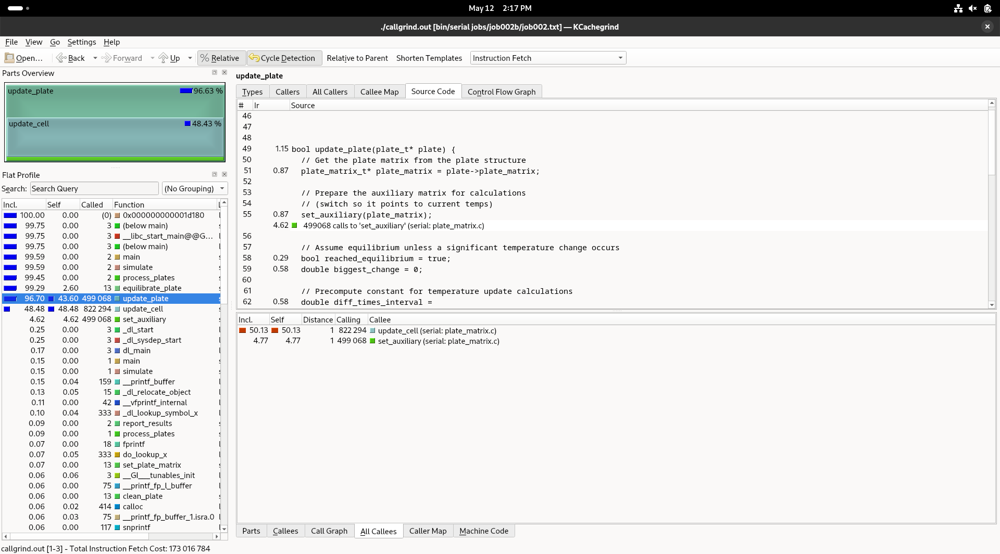
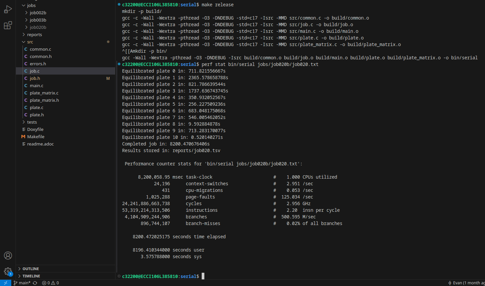
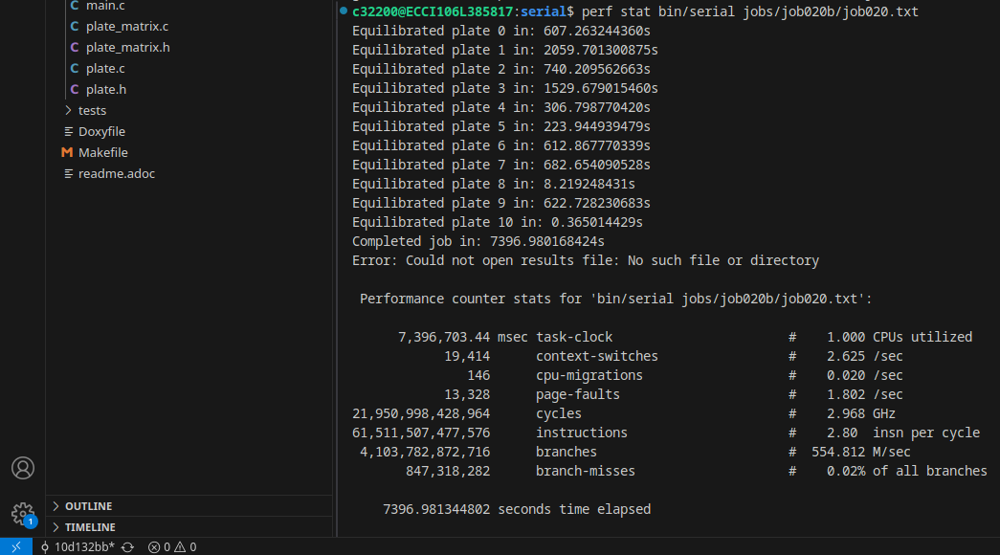
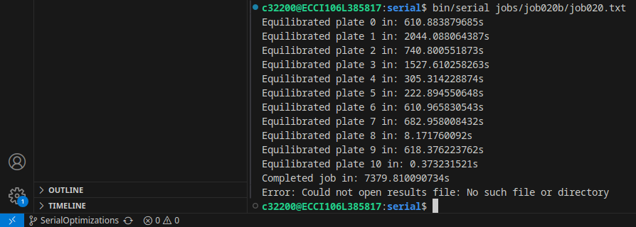
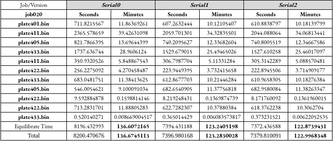
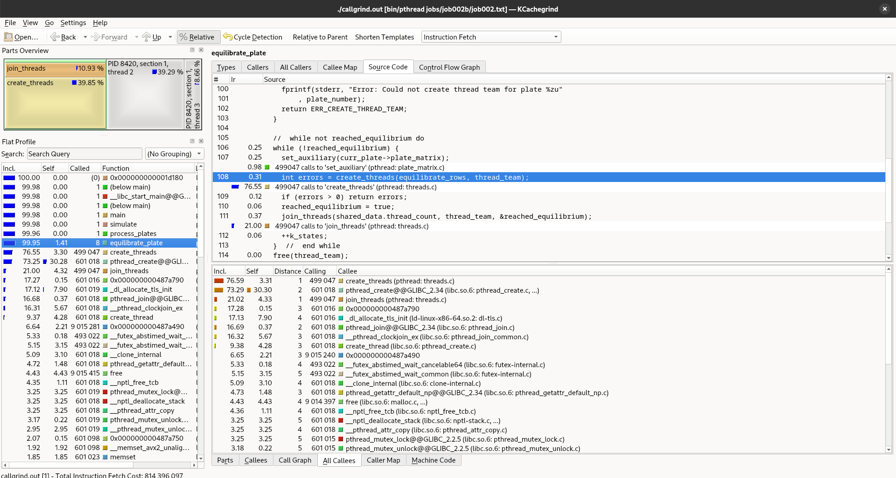
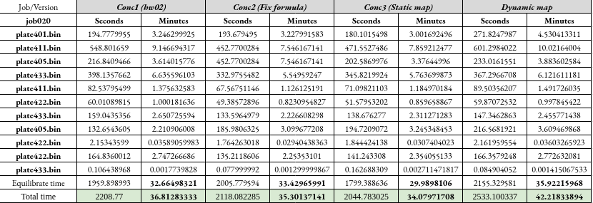
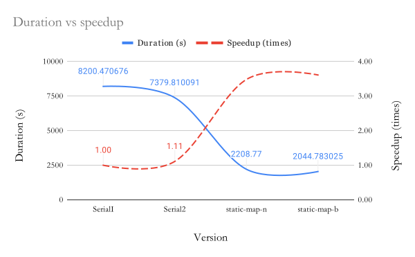
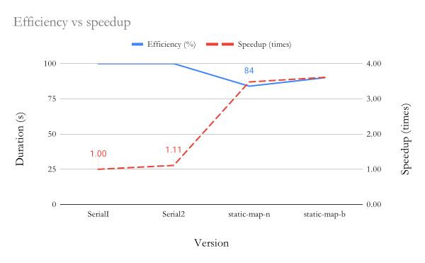
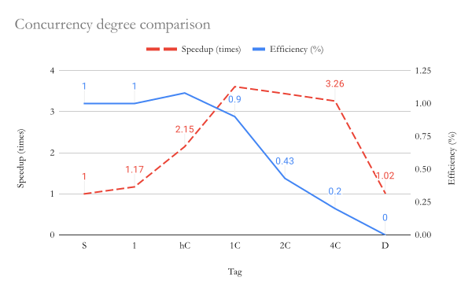

= Optimizations Report
:experimental:
:nofooter:
:source-highlighter: highlightjs
:sectnums:
:stem: latexmath
:toc:
:xrefstyle: short

== Versions History
Several versions of the heat transfer simulation have been created, seeking to optimize and reduce the processing time of jobs. The following table summarizes all existing versions of the heat transfer simulation. Note that different branches were used to preserve previous official versions and allow widespread testing.

[%autowidth]
|=== 
s|# s|Id s|Branch s|Folder s|Description
| 1 | Serial0 (hw01) m| main m| serial/ | Initial serial version
| 2 | Serial1 m| SerialOptimizations m| serial/ | Added flattened matrix and avoided unnecessary calculations
| 3 | Conc1 (hw02) m| main m|pthread/ | Attempt of static map without formula and no thread reutilization
| 4 | Conc2 m| ConcurrentStaticNoBarrier m|pthread/ | Added static map formula usage and flattened matrix to Conc1
| 5 | Conc3 m| ConcurrentStatic m|pthread/ | Added barriers and thread reutilization (static map by blocks)
| 6 | Conc4 m| ConcurrentDynamic m|pthread/ | Modify Conc1 to implement dynamic map with producer-consumer pattern
|===

To switch from branches, use the `git checkout [branchname]` command in terminal.

== Serial Optimizations
=== Profiling
The initial serial version had potential optimization points, like reducing access times by flattening the matrix into an array, and avoiding unnecessary calculations during every equilibrating iteration. This is further backed up by the profiling process made with KCachegrind, where there is considerable CPU occupation with the update_plate and update_cell procedures. 

[[img_profiling]]
.Screenshot of profiling with Kcachegrind in initial serial version (hw01)

For instance, the update_plate procedure calculated the multiplication constant every equilibrating iteration, when it could be done once only, before invoking the procedure.

The following figure shows the results of executing the original serial version of the program with the `job020` file, one of the more time-consuming jobs given the large plates it involves. It's note-worthy to mention that all serial versions were executed in the 106 laboratory of the University of Costa Rica.

[[img_serial0]]
.Screenshot of terminal after executing serial0 version (original)

The job was completed in *8200.470676406 seconds*, or roughly *2 hours and 17 minutes*, meaning there was lot's of wiggle (improvement) space for the following optimizations.

=== Serial1: Flattening the matrix
This first optimization consisted in implementing the plate as an array instead of a matrix. Advantages of this modification include reduction of cache misses (given that secondary pointers to rows are removed) and faster looping through the plate. However, there is a risk that using an array instead of a matrix could present problems for plates of greater sizes, given that it makes the program dependent on the capacity of the machine running it (the array implies continuous memory).

The following figure shows the results of executing this version with `job020`.

[[img_serial1]]
.Screenshot of terminal after executing serial1 version (flattened matrix)

Compared to its predecessor, this version proved to equilibrate each plate considerably faster, with a final execution time of *7396.980168424 seconds*, or approximately *2 hours and 4 minutes*. This shows a 13 minute improvement. However, another potential optimization was discovered after implementing the flattened matrix: reducing unnecessary calculations, which will be discussed in the next section.

=== Serial2: Reduce calculations
A second part of the serial optimization consisted in avoiding the multiplication constant calculation multiple times and instead, calculate it once before the while loop to equilibrate the plate, passing it as a parameter. These changes were made to the plate and job classes, moving the calculation from `update_plate()` to `equilibrate_plate()`, which calls the former.

The following figure presents the results of testing this version with the same job that serial0 and serial1 were tested with.

[[img_serial2]]
.Screenshot of terminal after executing serial2 version (reduce unnecessary calculations)

The results were not as positive as expected, with little to no improvement (*7379.810091 seconds* of equilibration time, translated to *2 hours and 3 minutes*). Evidently, avoiding the re-calculation of the multiplication constant did not really improve the runtime of the program by a lot.

=== Comparison table
The following table summarizes the total duration and speedup of each serial optimization.

[%autowidth]
|===
s| Itr s| Tag s| Duration s| Speedup s| Brief Description
|- | Serial0 | 8200.47 | 1.00 | Initial version (hw01)
|1 | Serial1 | 7396.98 | 1.11 | Flattened matrix into array
|2 | Serial2 | 7379.81 | 1.11 | Avoid unnecessary calculations
|===

Similarly, this second table shows the changes between the equilibrium durations of each plate in seconds and minutes, often improvements, but with the occasional exception of a worse duration.

[[img_serial_table]]
.Detailed table with durations for each plate across serial versions

== Concurrent Optimizations
Upon executing the initial concurrent version of the program (hw02) with `job020` three times, the best duration was *2208.77 seconds*, or rougbly *37 minutes*. This was a *1 hour 26 minutes* improvement from the final serial version, which was unexpected, given the inadequate distribution of rows and the creates and joins for each state of the simulation. 

This is better demonstrated with the callgrind profiling, executed with the `job002` file.

[[img_profiling_conc_main]]
.Main thread part profiling

In <<img_profiling_conc_main>>, it's evident that the pthread_create() function occupies the CPU more, and the procedures to create and join threads are called several times. Thus, this will be one of the main points to optimize.

=== Conc2: Proper use of static by blocks formula
The initial concurrent version implemented a static map by blocks, but without using the proper formula. Thus, the first optimization that could be done was properly distributing the rows with the formula. This optimization was implemented by only changing the distribution process for each plate, and resulted in a minimal improvement in execution time (*2118.08 seconds*, around *36 minutes*) relative to the initial concurrent version.

=== Conc3: Thread reuse with barriers
The previous optimization's poor performance could be due to the thread creation and join process, which was still hindering the program's execution time. Thus, the next step was to avoid that, by reusing the threads and coordinating with barriers. This meant that threads were created once and joined once, and the procedure each thread ran would not stop until the plate was equilibrated.

The results for this optimization were not as groundbreaking as expected, with a best duration of *2044.78302451 seconds*, or approximately *35 minutes*, a mere 1 minute improvement from Conc2 and 2 minutes compared to the initial version. However, it was the optimization that yielded the best speedup (3.61 times faster) and efficiency (0.90 or 90%) relative to the final serial version.

=== Dynamic map: Production consumer pattern
To test out the alternative map type, a producer consumer pattern was identified in the simulation: the main thread assigned rows by enqueing them to a monitor and secondary threads consumed from them. After completing each state, the main thread would determine if the plate was equilibrated, and moved on to the next one if it was ready. After simulating all plates, the main thread would send stop conditions to the threads through the queue, and then join them.

This solution assured a singular point of creation and termination (join) for threads, even less than the thread reuse approach. However, the results of executing the program with the same job as the static map versions proved to have longer durations on average, with the fastest time being *2533.100336547 seconds* (almost *43 minutes*).

Though still a 1 hour and 20 minute improvement compared to the final serial version, it had the worst speedup (*2.91 times faster*) and efficiency (*0.73 or 73% more efficient*) from all of the concurrent optimizations.

=== Static vs Dynamic Map
As it was mentioned before, the dynamic map approach had worse duration, speedup and efficiency compared to the static map one, with a 0.7 difference in speedup and 0.17 difference for efficiency, totalling an 8 minute difference between the two.

Nonetheless, this was an expected outcome, given that dynamic mapping is more unpredicatble than static mapping. Moreover, for this problem, where plates have fixed equilibrium times, the ideal map type is static.

In summary, both map types incremented the simulation's speed, but *static mapping by blocks proved to be more efficient*.

=== Comparison table
The following table summarizes the total duration, speedup, and efficiency of each concurrent optimization, using the final serial version as a baseline.

[%autowidth]
|===
s| Itr s| Tag s| Duration s| Speedup s| Efficiency s| Brief Description
|- | Serial2 | 7379.81 | 1.00 | 1.00 | Final serial version
|1 | Conc1 | 2208.77 | 3.34 | 0.84 | Initial concurrent version (hw02)
|2 | Conc2 | 2118.08 | 3.48 | 0.87 | Static map (no thread reuse)
|3 | Conc3 | 2044.78 | 3.61 | 0.90 | Static map with barriers
|4 | - | 2533.10 | 2.91 | 0.73 | Dynamic map
|===

Moreover, this table shows more specific durations for each plate's heat transfer simulation, for the executions with the best times across concurrent versions.

[[img_conc_table]]
.Detailed table with durations for each plate across concurrent versions

NOTE: Screenshots of all concurrent executions, made in the Poas cluster with the same amount of threads as cores available (4), can be found in the `images/conc_executions/` folder.

To summarize, the proper static map by blocks solution had the best results of the concurrent optimizations, and thus will be considered the final concurrent version.

== Comparing Optimizations
To properly show the potential of optimizing with concurrency, a comparison between the serial and concurrent optimizations can be made. The difference in duration, speedup, and efficiency between each relevant version (initial serial, final serial, initial concurrent, and final concurrent) will be visualized with graphs. Two comparisons will be presented: duration with speedup, and efficiency with speedup.

=== Duration vs Speedup
As it has been stated, there was a significant improvement in duration from the initial serial version (SerialI), to the final concurrent version (static-map-b). The following graph (<<graph_dur_vs_speedup>>) traces the decrease in execution time working the same "heavy" job file, *from 2 hours to just half an hour*, along with a notable increase in speedup across versions, calculated by dividing the initial time (Serial1's duration) with the optimization's duration. static-map-b, which implemented static mapping by blocks, was 3.61 times faster than the original version, proving to be the best of all the versions of the program.

[[graph_dur_vs_speedup]]
.Graph for duration-speedup comparison

NOTE: static-map-n, has n standing for no barriers, and the final version has a b at the end for barriers.

=== Efficiency vs Speedup
Efficiency, calculated by dividing the speedup with the amount of threads used in the execution, represents whether the speedup was acceptable in relation to the resources used to achieve it. In <<graph_eff_vs_speedup>>, one can notice that for the concurrent versions, the efficiency is maintained fairly high for both, meaning that using an amount of threads equal to the amount of cores available (in this case, 4) in the simulation is worth the considerable speedup both achieve.

[[graph_eff_vs_speedup]]
.Graph for efficiency-speedup comparison

NOTE: Though normally a number bellow 1, the efficiency is reported as a percentage in the graph.

== Comparing Degrees of Concurrency
Apart from comparing optimizations, another variable one could compare is the effect of the degree of concurrency (amount of threads utilized) on the execution of the program. To test this out, different thread amounts were defined based on the amount of CPU's in the executing computer. Given that the Poas cluster was used, and the nodes had 4 cores, 4 threads would be the 1C that adjusted the other thread counts.

=== Comparison table
Index for the comparison table, presenting the specific thread amounts given the case we are trying to test.
[%autowidth]
|===
s| Tag s| Amount of threads
| S | 1 thread (final serial version)
| 1 | 1 thread (ran with final concurrent version)
| hC | As many threads as half the amount of the CPU's in the executing computer (2)
| 1C | As many threads the amount CPU's in the executing computer (4)
| 2C | Twice as many threads as the amount of CPU's in the executing computer (8)
| 4C | Four times as many threads as the amount of CPU's in the executing computer (16)
| D | As many threads as the max amount of decomposition units in job (8190)
|===

The following table presents the best speedups and efficiencies from executing the final concurrent version to complete `job020` with different amount of threads, using the final serial version as a baseline.

[%autowidth]
|===
s| Tag s| Duration (seconds) s| Speedup (times) s| Efficiency (%)
|S | 7379.82 | 1.00 | 1.00
|1 | 6281.27 | 1.17 | 1.00
|hC | 3431.15 | 2.15 | 1.08
|1C | 2044.78| 3.61 | 0.90
|2C | 2142.34 | 3.44 | 0.43
|4C | 2267.211806733| 3.26 | 0.2
|D | > 7200 | 1.02 | 0
|===

NOTE: All concurrent versions were at least executed twice. Screenshots of these executions, made in the Poas cluster, can be found in the `images/conc_executions/conc_final_threads/` folder.

=== Graph
[[graph_conc_degree]]
.Graph for degree of concurrence comparison

=== Unexpected cases
TWo of the results stand out due to their peculiarty. First of all, the executions with half as many threads as CPU's were available in the nodes of the cluster always resulted in an efficiency greater than 1 (relative to the final serial version), despite implementing the same algorithm as the serial version.

Moreover, the executions with D amount of threads (in this case, 8190), exceeded the two hours of execution time, thus it was terminated by the cluster. Nonetheless, the efficiency proved to be 0 even if the minimum value: two hours, was temporarily placed in its place.

=== Results analysis
After analyzing <<graph_conc_degree>>, and the charts, it's clear that the intersection between efficiency and speedup regarding thread amount, occurs in 1C, where the "default" amount of threads are used. It's interesting to note that this was also an inflection point, where amounts leading up had better and better results, and the amounts following it caused no increase in speedup, with the efficiency quickly crashing down to 0 by the tests.

This is likely due to the fact that 1C made the most out of the CPU's available without having to share them with other threads. Also, given the many serialized parts in the final concurrent version (barriers and mutex), coordination between more threads made the waits longer, thus the execution times were worse.

In conclusion, for this program, the degree of concurrency with the best performance is equal to the amount of CPU's available in the executing machine.
