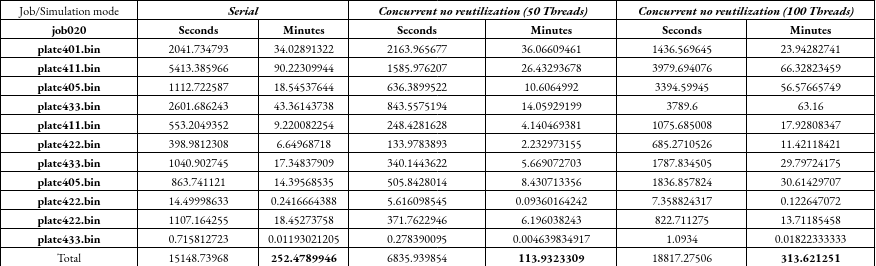

= Design of solution
:experimental:
:nofooter:
:source-highlighter: highlightjs
:sectnums:
:stem: latexmath
:toc:
:xrefstyle: short

[[analysis]]
== Initial Analysis (Brainstorm)

I first tried to identify where the program could use threads. The initial and final stages of the simulation were discarded, given that reading from and writing to files required order. This meant that only after setting the job and plates, during the actual simulation, could threads be implemented.

With this in mind, and in consideration of the suggestion about preferring conditional safety over concurrency control, I opted for dividing plates into different row sections, and then assigning them to threads. Thread creation would happen before each state commenced, and they would be joined once they finished their section.

<<concurrency_brainstorm>> is an informal visualization of the initial idea for adding concurrency to the simulation.

[#concurrency_brainstorm]
.Idea for concurrency
image::concurrency_brainstorm.svg[align="center"]

[[object_design]]
== Object-oriented design

Based on the previous analysis, I came to the conclusion that each worker of the thread team had to have access to shared variables like the plate matrix that was being worked on, the epsilon (to compare differences with), the multiplication constant in the heat transfer formula, and the total amount of threads.

For private data, each thread had a thread id, a starting row and an ending row (inclusive), limiting their access to the matrices, a flag to indicate if their section was equilibrated (each difference is less than epsilon), and a pointer to the shared data.

Finally, some threads manipulation procedures were needed: one to create and set each element of an array of private data, another to create the threads, one to join, and a last one to calculate the intervals of each section.

<<class_diagram>> shows the two new structs added to this concurrent  version: private_data and shared_data. 
[#class_diagram]
.UML class diagram for the program
image::heat_simul_uml.svg[align="center"]

[[concurrent_design]]
== Concurrent Design
=== Memory distribution
<<distribution_example>> is an example of how rows would be distributed for a matrix with 6 rows. Excluding the first and last row, we have 4 rows to evaluate. If two threads were solicited, then each would take half of the plate: upper two rows (1-2) and bottom two (3-4). Note that thread_id was not included in this visualization.

[#distribution_example]
.Example of distributions
image::concurrency_visualization.svg[align="center"]

Contrastingly, if three threads were solicited in the exec command, the first two rows would be in charge of rows 1 and 2 respectively, while the last one would cover 3 and 4. If 4 or more threads were specified, only 4 threads would work on the plate, with one row assigned to each.

[[threads_pseudo]]
== Pseudocode
=== Changes to simulation
First of all, the simulation-related procedure with the most changes was equilibrate_plate(), which now received an extra parameter thread_count. It is in charge of setting private and shared data, before actually simulating the plate. The pseudocode can be found below

[source,delphi]
----
include::pseudocode/simulate.pseudo[]
----

=== Thread related
The following pseudocode is related to the described threads manipulation procedures.

[source,delphi]
----
include::pseudocode/threads.pseudo[]
----

=== Equilibrate rows
Finally, we can look at the procedure called by each thread, which is in charge of simulating the heat transfer of a designated section in the plate, and determines if said area was equilibrated. This procedure takes update_plate()'s place in the plates.c file.

[source,delphi]
----
include::pseudocode/equilibrate_rows.pseudo[]
----

[[results_analysis]]
== Results Analysis
After implementing the concurrent solution, several tests were made to check if the program's performance improved. At first, I tried to run the smaller job files (001-003), but it turned out they were slower than the simulations without concurrence.

However, with a bigger job like 020, a significant improvement in runtime could be identified (with 50 threads), compared to the serial runtime of the job. However, with 100 threads (or more), things were different, and some plates required a longer processing time than its serial counterpart. The following table shows the recorded runtimes for each plate of job020.

[#durations_table]
.Recorded durations upong simulating job020.txt with different parameters

As it was mentioned before, running the simulation with 50 threads proved to have an overall improvement of almost 140 minutes from the serial version's duration, albeit with an increase in processing duration for the first plate.

Conversely, running the simulation with 100 threads proved to be slower, with an increase of almost an hour of total simulation time. From this experiment, I can conclude that the cost of creating and joining threads multiple times for each plate can prove to be more time-consuming than just processing the simulation with one thread: the more threads to manage, the slower the simulation will be.

To avoid this, and perhaps optimize runtime, an optimization option could be creating threads before simulating each plate and coordinating the team so that they don't stop working until the plate is equilibrated. In other words, if I could organize and reuse threads properly, execution times for each job could significantly improve.
