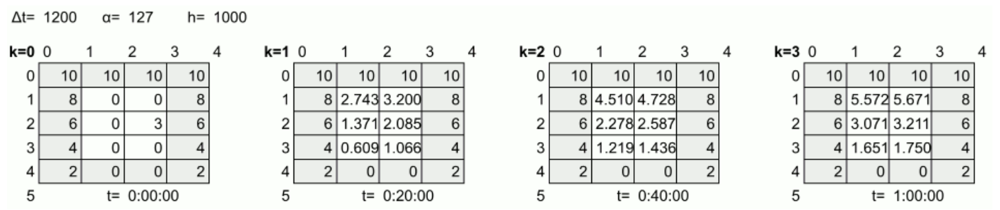

= Heat Transfer Simulation (Concurrent)
:experimental:
:nofooter:
:source-highlighter: highlightjs
:sectnums:
:stem: latexmath
:toc:
:xrefstyle: short

[[problem_statement]]
== Problem description

This simulation models the time evolution of heat distribution in a rectangular plate with R rows and C columns, determining when all square cells reach thermal equilibrium. Each cell's temperature, except the border cells' (temperature injection points), updates iteratively based on heat transfer with its four immediate neighbors. 

The new temperature at time step k+1 is calculated using the current temperature, the thermal diffusivity of the material, the cell area, and the net energy exchanged with adjacent cells, with formula: stem:[T_{i,j}^{k+1} = T_{i,j}^{k} + \frac{\Delta t\cdot \alpha}{h^2}(T_{i-1,j}^{k}+T_{i,j+1}^{k}+T_{i+1,j}^{k}+T_{i,j-1}^{k}-4T_{i,j}^{k})], where:

- stem:[T_{i,j}^{k}] represents temperature at state k (current temperature), in row i, column j

- stem:[T_{i,j}^{k+1}] represents the new temperature of the same cell

- stem:[\Delta t] is the duration of the interval between states (the greater the interval, the more energy can be transferred)

- stem:[\alpha] is the thermal diffusivity of the plate's material, which determines how fast energy is transmitted: the greater the thermal diffusivity, the faster it occurs.

- stem:[h^2] is the area of each cell (the greater the area, the slower energy is spread)

- stem:[T_{i-1,j}^{k}+T_{i,j+1}^{k}+T_{i+1,j}^{k}+T_{i,j-1}^{k}] represents the energy received from immediate neighbors (horizontal and vertical)

- stem:[-4T_{i,j}^{k}] is the energy that the cell itself transmitted to its four neighors.

The update formula follows a discrete approximation of the heat equation, with the use of an equilibrium point constant (epsilon), ensuring a realistic simulation of thermal equilibrium.

In short, this program simulates the heat transfer process of rectangular plates and reports how much time was needed to reach thermal equilibrium.

An example of the simulation of a plate is shown below:

[[figure]]
.Example simulation of heat transfer of a plate

Notice that the temperatures of non-border cells change in every k state, and that the updating process would continue on until all cells have a difference less than a specified epsilon.

[[io_example]]
== Input output example
This section details the format that job files and plate files must have in order to correclty execute the program. 

Assuming we ran the program with jobs/job002b/job002.txt, with format `plate_file_name interval_duration     thermal_diffusivity     cell_dimensions      epsilon` as shown below:

Input example (job002.txt):

[source]
----
include::tests/input001.txt[]
----

and the specified binary plate files with format `rows columns {rows of columns amount of doubles}` stored in the same directory, the following output should be shown in a .tsv report generated in reports/. This file will have the same format and name as its corresponding job, but will add the amount of states simulated until reaching thermal equilibrium, and a `years/months/days hours/minutes/seconds` format time equivalent, at the end of each line.

Output example (job002.tsv)

[source]
----
include::tests/output001.txt[]
----

For more detailed information, visit link:[https://jeisson.ecci.ucr.ac.cr/concurrente/2025a/tareas/#documentation].

[[design]]
== Design of solution

#See the link:design/readme.adoc[design/] folder for an overall design of the solution.#

[[user_manual]]
== User manual

[[build]]
=== Build

Compile the program with the following command

`make release`

[[usage]]
=== Usage
To execute the program, first make sure you have a correctly formatted job file (like the exmaple shown above) with the mentioned plate files, preferrably in the jobs/ folder. If not, remember to specify the folder path when running the execution command, which has the format:

`bin/pthread {folder_with_job}/{job_file_name}`

An example execution command could be: `bin/pthread jobs/job001b/job001.txt`

*IMPORTANT*: Note that this program has been adapted to allow concurrency in the simulation, thus, a second argument can be added to the execution command to specify the amount of threads to use. The program will run with a default amount if not specified.

`bin/pthread {folder_with_job}/{job_file_name} {thread_count}`

Add a valid amount to the command like so: `bin/pthread jobs/job001b/job001.txt 10` This way, the simulation will execute with 10 threads.

Furthermore, note that once the simulation ends, updated plate files with the number of states simulated in their names, written in binary, will be stored in the same directory as the job file. The .tsv report of the job will be stored in the results/ folder, with the same name as the job.

For example, jobs/job002b/job002.txt, with a request to simulate plate001.bin (and others), would result in the creation of a plate001-12.bin (12 states until equilibrium) file in jobs/job002b/, and job002.tsv report in reports/.

=== Output examples
If the program executed without errors, a message indicating where the report file was stored will be shown in terminal.

[example]
====
`quilibrated plate {plate_number} in {seconds}s`

`...`

`Completed job in: {seconds}s`

`Results stored in: reports/job###.tsv`
====

However, if certain criteria are met, error messages could show as well. The following table illustrates the possible outcomes.

[%autowidth]
|===
s|_Error code_ s|_Error_ s|_Output Message_
|2 | *No job file specified* m|`usage: bin/pthread job_file_path thread_count (count optional)`
|3 | *Invalid thread count (negative, 0 or greater than max threads)* m|`Error: Invalid thread count (0 < thread_count <= 32000)`
|11 | Allocation for job struct failed m|`Error: Memory for job could not be allocated`
|11 | Allocation for plates array failed m|`Error: Memory for plates could not be allocated`
|12 | *Invalid job file name sent as argument* m|`Error: Job file could not be opened`
|13 | Failed to allocate memory for plate struct m|`Error: Memory for new plate could not be allocated`
|14 | Could not allocate memory for plate name m|`Error: Memory for plate file name could not be allocated`
|15 | Could not reallocate memory for plates array m|`Error: Could not expand plates array`
|16 | Could not build results file path m|`Error: Results file path could not be built`
|17 | Could not open results file m|`Error: Could not open results file`
|21 | *Incorrect plate file name in job file* m|`Error: Plate file {file_name} could not be opened`
|22 | *No plate file extension specified* m|`Error: no extension specified for plate file`
|22 | Could not allocate memory for plate file m|`Error: Memory allocation failed for plate file name`
|23 | *Rows and cols values in plate file incorrect or failed to store* m|`Error: Rows and cols could not be read`
|24 | Plate output file's path could not be built m|`Error: Could not build output file name`
|25 | Plate output file could not be opened m|`Error: Could not open output file`
|31 | Thread team could not be created m|`Error: Could not create thread team for plate ##`
|32 | Thread could not be created m|`Error: could not create thread ##`
|## | Threads failed to join (## is amount that failed to join) m|`Error: could not join thread ##`

|===

Note that only errors in bold can be fixed by user, and the rest are system issues. Use command `echo $?` in terminal to check error code returned and verify with chart.
[[credits]]
== Credits

Completed by Evan Chen Cheng <evan.chen@ucr.ac.cr>

Project assigned by Dr. Jeisson Hidalgo <jeisson.hidalgo@ucr.ac.cr>

Code from aforementioned professor included.
