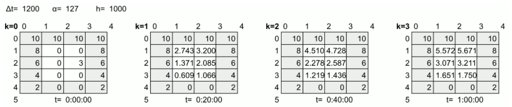

= Heat Transfer Simulation (Serial)
:experimental:
:nofooter:
:source-highlighter: highlightjs
:sectnums:
:stem: latexmath
:toc:
:xrefstyle: short

[[problem_statement]]
== Problem description

This simulation models the time evolution of heat distribution in a rectangular plate with R rows and C columns, determining when all square cells reach thermal equilibrium. Each cell's temperature, except the border cells' (temperature injection points), updates iteratively based on heat transfer with its four immediate neighbors. 

The new temperature at time step k+1 is calculated using the current temperature, the thermal diffusivity of the material, the cell area, and the net energy exchanged with adjacent cells, with formula: stem:[T_{i,j}^{k+1} = T_{i,j}^{k} + \frac{\Delta t\cdot \alpha}{h^2}(T_{i-1,j}^{k}+T_{i,j+1}^{k}+T_{i+1,j}^{k}+T_{i,j-1}^{k}-4T_{i,j}^{k})], where stem:[T_{i,j}^{k}] represents temperature at state k (current temperature), in row i, column j and stem:[T_{i,j}^{k+1}] represents the new temperature of the same cell. 

The update formula follows a discrete approximation of the heat equation, with the use of an equilibrium point constant (epsilon), ensuring a realistic simulation of thermal equilibrium.

In short, this program simulates the heat transfer process of rectangular plates and reports how much time was needed to reach thermal equilibrium.

An example of the simulation of a plate is shown below:

[[figure]]
.Example simulation of heat transfer of a plate

Notice that the temperatures of non-border cells change in every k state, and that the updating process would continue on until all cells have a difference less than a specified epsilon.

[[io_example]]
== Input output example
This section details the format that job files and plate files must have in order to correclty execute the program. 

Assuming we ran the program with jobs/job002b/job002.txt, with format `plate_file_name interval_duration     thermal_diffusivity     cell_dimensions      epsilon` as shown below:

Input example (job002.txt):

[source]
----
include::tests/input001.txt[]
----

and the specified binary plate files with format `rows columns {rows of columns amount of doubles}` stored in the same directory, the following output should be shown in a .tsv report generated in reports/. This file will have the same format and name as its corresponding job, but will add the amount of states simulated until reaching thermal equilibrium, and a `years/months/days hours/minutes/seconds` format time equivalent, at the end of each line.

Output example (job002.tsv)

[source]
----
include::tests/output001.txt[]
----

For more detailed information, visit link:[https://jeisson.ecci.ucr.ac.cr/concurrente/2025a/tareas/#documentation].

[[design]]
== Design of solution

#See the link:design/readme.adoc[design/] folder for an overall design of the solution.#

[[user_manual]]
== User manual

[[build]]
=== Build

Compile the program with the following command

`make release`

[[usage]]
=== Usage

To execute the program, first make sure you have a correctly formatted job file (like the exmaple shown above) with the mentioned plate files, preferrably in the jobs/ folder. If not, remember to specify the folder path when running the execution command, which has the format:

`bin/serial {folder_with_job}/{job_file_name}`

An example execution command could be: `bin/serial jobs/job001b/job001.txt`

Storing job files and plate files in the root directory serial/ is also valid, but not recommended, given the results could be unorganized with the rest of the program.

Notice that by using the `make run` command, job002.txt from jobs/job002b/ will automatically be processed.

Furthermore, note that once the simulation ends, updated plate files with the number of states simulated in their names, written in binary, will be stored in the same directory as the job file. The .tsv report of the job will be stored in the results/ folder, with the same name as the job.

For example, jobs/job002b/job002.txt, with a request to simulate plate001.bin (and others), would result in the creation of a plate001-12.bin (12 states until equilibrium) file in jobs/job002b/, and job002.tsv report in reports/.

[[credits]]
== Credits

Completed by Evan Chen Cheng <evan.chen@ucr.ac.cr>

Project assigned by Dr. Jeisson Hidalgo <jeisson.hidalgo@ucr.ac.cr>

Code from aforementioned professor included.
