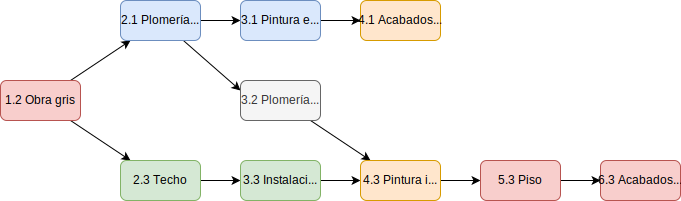

= Construcción de edificio [building_tasks]
:experimental:
:nofooter:
:source-highlighter: pygments
:sectnums:
:stem: latexmath
:toc:
:xrefstyle: short

Suponga usted va a construir el edificio para su organización. Para que quede lo mejor posible, usted sólo va a contratar una persona especializada para cada tarea del proceso de construcción. Estas tareas están expresadas en el siguiente _grafo de tareas_.

[[fig_building_tasks]]
.Grafo de tareas de la construcción de un edificio

En un *grafo de tareas* (_task graph_) los nodos son tareas de un proceso a realizar, y los vértices son dependencias. Un vértice dirigido de _A_ hacia _B_ indica que la tarea _A_ debe completarse para poder iniciar la tarea _B_, dado que la salida o productos generados por la tarea _A_ son requeridos por la tarea _B_. Una tarea puede iniciarse sólo si todas sus dependencias han sido completadas. Dos o más tareas en esta condición pueden realizarse en paralelo.

Se modeló esta situación en un programa concurrente. El maestro de obras (_foreman_) es el hilo principal que contrató a cada albañil experto. Cada albañil (_builder_) reporta en la salida estándar cuando inicia su labor. Luego representa el tiempo dedicado con una espera aleatoria. Una vez que finalizada su labor, lo reporta en la salida estándar.

Sin embargo hay un problema con el programa. Una vez que es ejecutado, todos los albañiles inician sus tareas de inmediato, sin respetar las dependencias del _grafo de tareas_. Por ejemplo, el experto en pintura exterior comienza a pintar las paredes que aún no se han construido. Por favor, corrija esta irrealista situación para que la simulación logre construir el edificio acorde a las dependencias. El programa será correcto cuando no haya forma de que un albañil inicie su actividad antes de que todas sus dependencias hayan sido completadas.