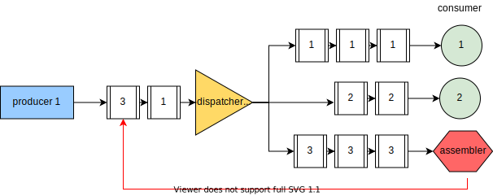

= Design of solution
:experimental:
:nofooter:
:source-highlighter: pygments
:stem:
:toc:
:xrefstyle: short

[#pseudocode]

Buffer acotado:

[source,delphi]
----
include::prodcons_bounded.pseudo[]
----

Buffer no acotado:

[source,delphi]
----
include::prodcons_unbounded.pseudo[]
----

